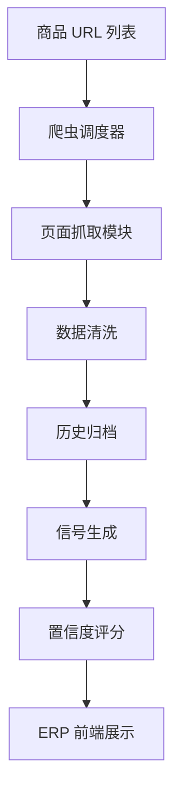

# Ozon ERP 网页采集模块设计（Markdown版）

> 本文档用于说明 ERP 系统网页采集模块的设计逻辑与数据流，不涉及具体代码。

---

## 1. 爬取目标设计

### A. 数据类型
- 商品信息：标题、SKU、类目、品牌
- 价格信息：历史价格、促销价格
- 排名信息：分类排名、搜索排名
- 评论信息：数量、时间、评分
- 库存/是否有货：通过页面按钮或提示判断

### B. 数据采集频率
- 高变化数据（价格、库存、排名）：每 4 小时
- 低变化数据（商品标题、类目）：每日或每周
- 评论增量：每日采集最新评论

---

## 2. 系统架构设计

### 数据采集层
- **入口**：商品 URL 列表（API 或数据库生成）
- **爬虫调度器**：控制并发量、限制访问频率、IP / User-Agent 轮换
- **抓取模块**：HTML 页面解析（XPath / CSS Selector / JSON API）、异常检测

### 数据处理层
- **清洗**：去重、字段标准化（价格统一货币、时间统一格式）
- **归档**：存入数据库历史表，支撑趋势计算

### 数据使用层
- **信号生成**：排名趋势、价格趋势、评论增长
- **置信度评分**：数据量、稳定性、波动性
- **前端展示**：商品列表、选品决策辅助、趋势图

---

## 3. 关键设计要点

1. **频率与分布**：避免高频访问同一 IP，使用分布式代理或云爬虫
2. **异常处理**：页面结构变化、请求失败 / CAPTCHA 自动重试或跳过
3. **数据质量控制**：保留原始抓取数据，关键字段完整性检查
4. **合规性设计**：仅抓取公开信息，不抓取用户隐私，遵守官方规则
5. **可扩展性**：每个网站独立规则配置，支持新增站点和字段

---

## 4. 数据流逻辑

